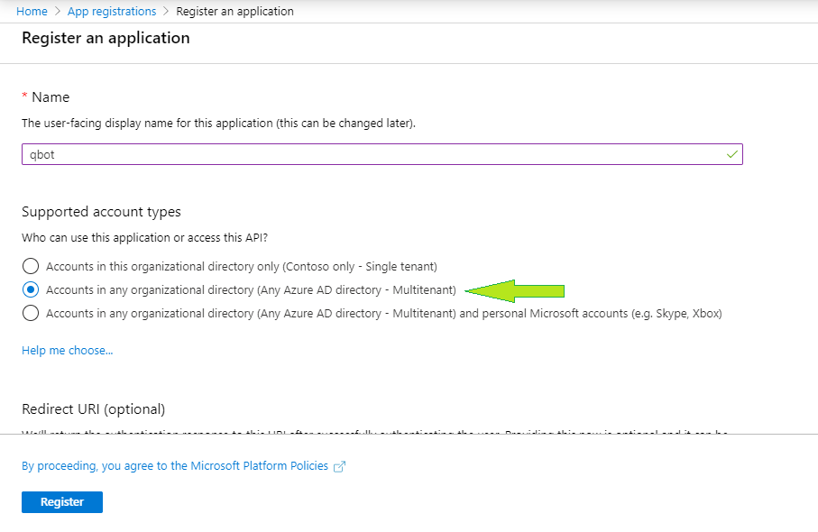
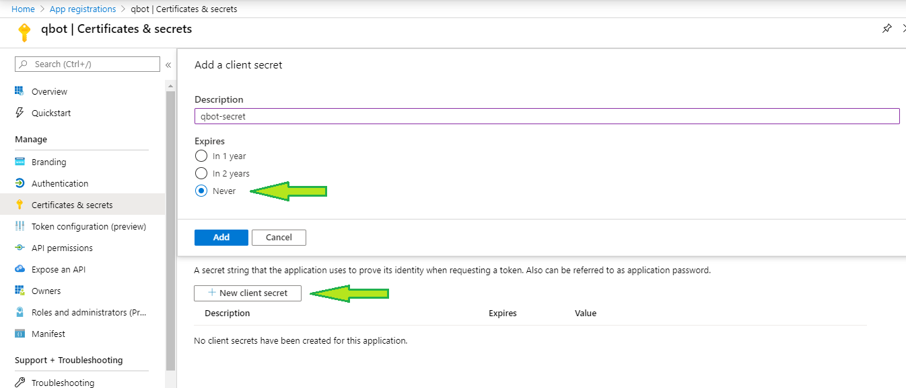
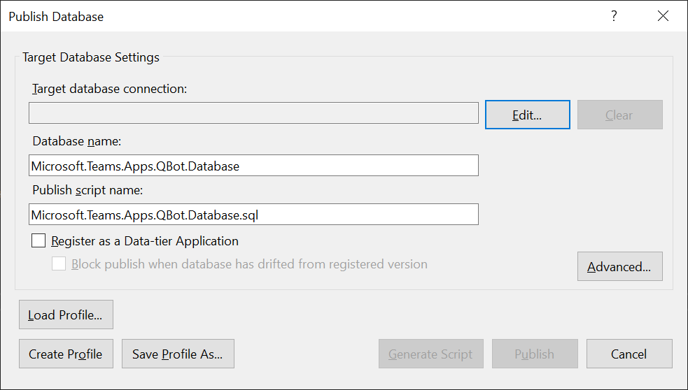

# Deployment Guide

## Pre-Requisites
To begin, we will need:
* Fork the repository. There will be some modifications required in the fork repository and use in deployment.
* Specify a base resource name for the application and save the name.
* An Office 365 tenant with Microsoft Teams turned on for the target set of users
* Access to create a new Team within the "O365 tenant"
* Access to create new App Registrations in the "Azure Active Directory" of the tenant
* Access grant admin consent for either Delegated or Application API permissions
* A QBot Service Account (if using Delegated permissions when calling Graph API). QBot service account is user account created in O365 tenant.
* An Azure subscription where you can create the following types of resources
  * App Service
  * App Service Plan
  * SQL Database
  * Bot Channels Registration
  * QnA Service
  * QnA Knowledge Base
* Some familiarity with building a .NET Web API project
* Some familiarity with building an Angular 7 application

Here is a summary of all Azure resources that need to be created:

|#|Resource Type|Description|
|:-|:-|:-|
|1|Resource Group (optional)|Logical container to place all QBot related Azure resources|
|2|Bot Channels Registration|QBot Bot Channels Registration|
|3|QnA Service|Cognitive Services to host QnA KBs|
|4|Azure Search Service|Provisioned as part of QnA Service, if required|
|5|QnA Knowledge Base|The backing QnA KB where QBot will get answers from.<br>You are required to have one QnA KB per Course|
|6|SQL Database|Stores QBot related processing data|
|8|App Service|Hosts the QBot API Web Service|
|9|App Service|Hosts the Dashboard Tab App Angular site|
|10|App Service|Hosts the Questions Tab App Angular site|
|11|App Registration|To support the QBot API authentication|
|12|App Registration|To support Graph API access|
|13|Azure Function App|To support the QnA Service|
---
# Step 1: Register Azure AD applications
Register two Azure AD applications in your tenant's directory: one for the bot, and another for the Graph API Access app.

### QBot API Auth App Registration
1. Log in to the Azure Portal for your subscription, and go to the "App registrations" blade [here](https://portal.azure.com/#blade/Microsoft_AAD_IAM/ActiveDirectoryMenuBlade/RegisteredApps).
2. Click on "New registration", and create an Azure AD application.
	1. **Name**: The name of your Teams app - if you are following the template for a default deployment, we recommend "Kronos workforce central".
	2. **Supported account types**: Select "Accounts in any organizational directory (Any Azure AD directory - Multitenant)"
3. Leave the "Redirect URI" field blank.
	
4. Click on the "Register" button.
5. When the app is registered, you'll be taken to the app's "Overview" page. Copy the **Application (client) ID**; we will need it later. Verify that the "Supported account types" is set to **Multiple organizations**.
	
6. On the side rail in the Manage section, navigate to the "Certificates & secrets" section. In the Client secrets section, click on "+ New client secret". Add a description for the secret and select an expiry time. Click "Add".
	

7. Once the client secret is created, copy its **Value**; we will need it later. Save the client secret.
8. On the side rail in the Overview section, please note the following settings for later use:
	Application (client) ID
	Directory (tenant) ID

At this point you have 3 unique values:
- Application (client) ID
- Client secret for the bot
- Directory (tenant) ID

We recommend that you copy these values into a text file, using an application like Notepad. We will need these values later during deployment.

### Graph API Access App Registration
The QBot API service in turn calls Graph API to retrieve information like the questions asked, and conversations within a channel. This App Registration is used to authenticate these Graph API calls.

This App Registration MUST be on the same tenant as your Teams instance. You will need to be an Application Administrator on your tenant.

Follow the steps from 1 to 8 specified in QBot API Auth App Registration section.

##### Application vs Delegated Permissions
You will need to grant Graph API permissions to this App Registration (the full list of permissions is below). QBot supports both Application and Delegated permission types, so choose one that is most appropriate for your organisation.

|Setting|Value|
|:-|:-|
|Account Type|*Accounts in any organizational directory (Any Azure AD directory - Multitenant)*|
|API Permissions|Add the following API permissions:<br><br>Name: **User.Read.All**<br>Type: **Application** or **Delegate**<br>Consent: **Required**<br><br>Name: **Group.ReadWrite.All**<br>Type: **Application** or **Delegate**<br>Consent: **Required**<br><br>Name: **Sites.ReadWrite.All**<br>Type: **Application** or **Delegate**<br>Consent: **Required**

When granting admin consent for these, you will need to be a Global Administrator on the respective tenant.

Go to Certificates and Secrets, add a new client secret with a suitable expiration date. Remember to copy the generated client secret.

If using any Delegated permissions, go to the Authentication tab, and set to treat application as public client by default


Please note the below values:
- Application (client) ID
- Client secret

# Step 2: Setup Angular apps - Dashboard Tab & Questions Tab for deployment
There are 2 Teams tabs, developed as Angular applications. They are in the projects: `DashboardTabApp` and `QuestionsTabApp`. Both are built and deployed in the same way.

In fork repository, open up `Source\DashboardTabApp\src\environments\environment.ts` and make the following changes
``` typescript
export const environment = {
    production: false,
    apiBaseUrl: "https://<<BaseResourceName>>.azurewebsites.net/api/Request/",
    
    authConfig: {
        instance: "https://login.microsoftonline.com/",
        tenantId: "xxxxxxxx-xxxx-xxxx-xxxx-xxxxxxxx",
        clientId: "xxxxxxxx-xxxx-xxxx-xxxx-xxxxxxxx",
        redirectUri: "/app-silent-end",
        cacheLocation: "localStorage",
        navigateToLoginRequestUrl: false,
        extraQueryParameters: "",
        popUp: true,
        popUpUri: "/app-silent-start",
        popUpWidth: 600,
        popUpHeight: 535
    },

    // do not populate the following:
    upn: "",
    tid: "",
};
```
Key|Value
:-|:-
apiBaseUrl|The URL where the QBot API Web App is deployed, with `/api/Request/` appended
tenantId|The Directory (tenant) ID of the [QBot API Auth App Registration](#qbot-api-auth-app-registration)
clientId|The Application (client) ID of the [QBot API Auth App Registration](#qbot-api-auth-app-registration)

Open up `Source\DashboardTabApp\src\environments\environment.prod.ts` and make the above changes.

------------
In the fork repository, open up `Source\QuestionTabApp\src\environments\environment.ts` and make the following changes
``` typescript
export const environment = {
    production: false,
    apiBaseUrl: "https://<<BaseResourceName>>.azurewebsites.net/api/Request/",
    selfUrl: "",

    authConfig: {
        instance: "https://login.microsoftonline.com/",
        tenantId: "xxxxxxxx-xxxx-xxxx-xxxx-xxxxxxxx",
        clientId: "xxxxxxxx-xxxx-xxxx-xxxx-xxxxxxxx",
        redirectUri: "/app-silent-end",
        cacheLocation: "localStorage",
        navigateToLoginRequestUrl: false,
        extraQueryParameters: "",
        popUp: true,
        popUpUri: "/app-silent-start",
        popUpWidth: 600,
        popUpHeight: 535
    },

    // do not populate the following:
    upn: "",
    tid: "",
    gid: "",
    cname: ""
};
```
Key|Value
:-|:-
apiBaseUrl|The URL where the QBot API Web App is deployed, with `/api/Request/` appended
tenantId|The Directory (tenant) ID of the [QBot API Auth App Registration](#qbot-api-auth-app-registration)
clientId|The Application (client) ID of the [QBot API Auth App Registration](#qbot-api-auth-app-registration)
selfUrl|The base URL where this [Questions Tab App](#questions-tab-web-app) (Angular app is deployed), eg: `https://<<BaseResourceName>>-questions.azurewebsites.net`|
Open up `Source\QuestionTabApp\src\environments\environment.prod.ts` and make the above changes.

# Step 3: Deploy to your Azure subscription
1. Click on the "Deploy to Azure" button below.
[](https://portal.azure.com/#create/Microsoft.Template/uri/https%3A%2F%2Fraw.githubusercontent.com%2Fvishnuabhrapudi%2Fmaster%2FDeployment%2Fazuredeploy.json)

2. When prompted, log in to your Azure subscription.

3. Azure will create a "Custom deployment" based on the ARM template and ask you to fill in the template parameters.

4. Select a subscription and resource group.
   * We recommend creating a new resource group.
   * The resource group location MUST be in a datacenter that supports: Application Insights; Azure Search; and QnA Maker. For an up-to-date list, click [here](https://azure.microsoft.com/en-us/global-infrastructure/services/?products=logic-apps,cognitive-services,search,monitor), and select a region where the following services are available:
     * Application Insights
     * QnA Maker
     * Azure Search

5. Enter a "Base Resource Name", which the template uses to generate names for the other resources.
   * The app service names `[Base Resource Name]`, `[Base Resource Name]-dashboard`, and `[Base Resource Name]-questions` must be available. For example, if you select `contosoqbot` as the base name, the names `contosoqbot`, `contosoqbot-dashboard`, and `contosoqbot-questions` must be available (not taken); otherwise, the deployment will fail with a Conflict error.
   * Remember the base resource name that you selected. We will need it later.
6. Fill in the below details
	1. **App Display Name**: The app (and bot) display name.
	2. **App Description**: The app (and bot) description.
	3. **App Icon Url**: The link to the icon for the app. It must resolve to a PNG file.
	4. **Bot Client Id**: The client ID of the QBot API Azure AD app, e.g., 123e4567-e89b-12d3-a456-426655440000.
	5. **Bot Client Secret**: The client secret of the QBot API Azure AD app.
	6. **Graph API ClientId**: The client ID of the Graph API Azure AD app, e.g., 123e4567-e89b-12d3-a456-426655440000.
	7. **Graph API Client Secret**: The client secret of the Graph API Azure AD app.
	8. **Graph API AAD Permission Type**: Either Application or Delegate, depending on how API access permissions were set up.
	9. **QBot Service Account**: QBot service account. Must be a valid Teams account. Only applicable when using Delegate permissions.
	10. **QBot Service Account Password**: Encrypted password of the above QBot service account. Only applicable when using Delegate permissions.
	11. **Sql Administrator Login**: The administrator username of the SQL Server.
	12. **Sql Administrator Login Password**: The administrator password of the SQL Server.
	13. **Location**: Location for all resources.
	14. **Tenant Id**: The ID of the tenant to which the app will be deployed.
	15. **sku**: The pricing tier for the hosting plan.
	16. **Plan Size**: The size of the hosting plan (small, medium, or large).
	17. **Sql Plan Size**: The size of the SQL Server.
	18. **Search Service Sku**: The pricing tier for the Azure Search service.
	19. **QnA Maker Sku**: The pricing tier for the QnAMaker service.
	20. **Git Repo Url**: The URL to the GitHub repository to deploy.
	21. **Git Branch**: The branch of the GitHub repository to deploy.

	Make sure that the values are copied as-is, with no extra spaces. The template checks that GUIDs are exactly 36 characters.

7. If you wish to change the app name, description, and icon from the defaults, modify the corresponding template parameters.

8. Agree to the Azure terms and conditions by clicking on the check box "I agree to the terms and conditions stated above" located at the bottom of the page.

9. Click on "Purchase" to start the deployment.

10. Wait for the deployment to finish. You can check the progress of the deployment from the "Notifications" pane of the Azure Portal. It can take more than 10 minutes for the deployment to finish.

11. Once the deployment has finished, you would be directed to a page that has the following fields:
    * botId - This is the Microsoft Application ID for the FAQ Plus bot.
    * appDomain - This is the base domain for the FAQ Plus Bot.
    * configurationAppUrl - This is the URL for the configuration web application.

# Step 4: Set up authentication for the Dashboard and Questions apps
1. Note the location of the Dashboard app and Questions app that you deployed, which is `https://[BaseResourceName]-dashboard.azurewebsites.net` and `https://[BaseResourceName]-questions.azurewebsites.net`. For example, if you chose "contosoqbot" as the base name, the dahboard app will be at `https://contosoqbot-dashboard.azurewebsites.net` and the questions app will be at `https://contosoqbot-questions.azurewebsites.net`.
2. Go back to the "App Registrations" page [here](https://portal.azure.com/#blade/Microsoft_AAD_IAM/ActiveDirectoryMenuBlade/RegisteredAppsPreview).

3. Click on the QBot API Auth app in the application list. Under "Manage", click on "Authentication" to bring up authentication settings.
4. Add a new entries to "Redirect URIs":
	1. First entry:
	    * **Type**: Web
	    * **Redirect URI**: If the base name is "contosoqbot", then enter "https://contosoqbot-dashboard.azurewebsites.net/app-silent-end"
	1. Second entry:
	    * **Type**: Web
	    * **Redirect URI**: If the base name is "contosoqbot", then enter "https://contosoqbot-questions.azurewebsites.net/app-silent-end"

5. Under "Implicit grant", check "ID tokens".

6. Click "Save" to commit your changes.

# Step 5: Setup SQL Server Schema
Clone the fork respository and open in Visual Studio. Run the included SSDT package to create the initial SQL database schema and seed data.
To do this within Visual Studio, right click on the "Microsoft.Teams.Apps.QBot.Database" project, and choose "Publish".
Fill in the target database connection which is saved from deployment output.



# Step 6: Create the QnA Maker knowledge base
QBot uses QnA maker as it's knowlege base of questions and answers. Each course in QBot will require a back-end QnA KB provisioned, and this relationship is 1-1, ie. One QnA KB required per QBot Course.

https://www.qnamaker.ai/Create

1. Create a new QnA Service. Select an appropriate pricing tier to store all KBs for all required courses
2. Create the KB, and take note of the KB Name
3. (Optional) Populate your KB with initial data or add a chit-chat persona.
4. Publish the KB


> Please take note of the following settings for later:<br><br>
> 
> 1. **QnA Service Host** - The full Host header
> 2. **QnA Knowledge Base ID** - The GUID part of the POST URL
> 3. **QnA Endpoint Key** - The GUID part of the Authorization header<br><br>
> 
> 4. **QnA HTTP Key**
> 5. **QnA HTTP Endpoint**

# Step 7: Deploy the Bot to Teams
### Prepare the manifest file

Edit the `manifest.json` file, and replace the following values:

``` json
{
  "$schema": "https://developer.microsoft.com/en-us/json-schemas/teams/v1.5/MicrosoftTeams.schema.json",
  "manifestVersion": "1.5",
  "version": "1.0.0",
  "id": "xxxxxxxx-xxxx-xxxx-xxxx-xxxxxxxx",
  "packageName": "qbot",
  "developer": {
    "name": "UNSW Sydney",
    "websiteUrl": "https://www.unsw.edu.au/QBot",
    "privacyUrl": "https://www.unsw.edu.au/QBot/privacy",
    "termsOfUseUrl": "https://www.unsw.edu.au/QBot/tou"
  },
  "icons": {
    "outline": "Outline.png",
    "color": "Color.png"
  },
  "name": {
    "short": "Question",
    "full": "Question - The Community Learning App"
  },
  "description": {
    "short": "QBot",
    "full": "QBot keeps track of answered and unanswered questions, sends notifications to tutors and teachers in charge, and dynamically constructs its own knowledge database on the subject to help suggest answers in future. Just tag @Question in the conversations tab of your class team."
  },
  "accentColor": "#6264A7",
  "configurableTabs": [
      {
        "configurationUrl": "https://qbot-questions-tab.azurewebsites.net/config?upn={loginHint}&tid={tid}&gid={groupId}&cname={channelName}",
        "canUpdateConfiguration": true,
        "scopes": [
          "team"
        ]
      }
    ],
  "bots": [
    {
      "botId": "xxxxxxxx-xxxx-xxxx-xxxx-xxxxxxxx",
      "scopes": [
        "team"
      ]
    }
  ],
  "staticTabs": [
    {
      "entityId": "DashboardTab",
      "name": "Dashboard",
      "contentUrl": "https://qbot-dashboard-tab.azurewebsites.net/home?upn={loginHint}&tid={tid}&gid={groupId}&uid={userObjectId}",
      "scopes": [ "personal" ]
    }
  ],
  "permissions": [
    "identity",
    "messageTeamMembers"
  ],
  "validDomains": [ "qbot-dashboard-tab.azurewebsites.net", "qbot-questions-tab.azurewebsites.net", "qbot-api.azurewebsites.net" ]
}
```

Key|Value
:-|:-
id|Microsoft AppID (GUID) from the [Bot Channel Registration](#bot-channels-registration)
botId|Microsoft AppID (GUID) from the [Bot Channel Registration](#bot-channels-registration).<br>Remember to replace **both instances** in the `manifest.json`
configurationUrl|URL of the deployed [Question Tab Angular web application](#questions-tab-web-app) with `/#/config?upn={upn}&tid={tid}&gid={gid}&cname={channelName}` appended.
contentUrl|URL of the deployed [Dashboard Tab Angular web application](#dashboard-tab-web-app) with `/#/home?upn={upn}&tid={tid}&gid={groupId}&uid={userObjectId}` appended.
validDomains|Array of three strings representing the domains of the [Bot API Web App](#qbot-api-web-app), [Question Tab](#questions-tab-web-app) and [Dashboard Tab](#dashboard-tab-web-app)


So now, within Manifest` folder there will be 3 files
* `manifest.json` - Manifest file, which we just updated in the steps above
* `Outline.png` - Outline transparent bot icon
* `Color.png` - Color bot icon

Zip up into a new package file (eg. `qbot-manifest.zip`) ready for upload into Microsoft Teams

### Option 1: Install QBot into your tenant app catalog (Recommended)
1. You must be a Teams or O365 tenant admin.
2. In Teams, go to the App Store from the left rail and choose *Upload a custom app* > Upload for your organization. 
3. Select the .zip file created earlier which will add the bot to your organization's tenant app catalog.
4. Any team owner can now click on the app from the Teams App Store > Built for your organization section and install it in the selected class team.

### Option 2: Sideload QBot app into your class team
1. You must be a team owner.
2. In Teams, go to the team the Bot will be deployed to and click on the ‘+’ symbol under the Team title at the top of the window.
3. In the popup click on *Manage apps* at the bottom right corner which will navigate to the Apps page for that team.
4. At the bottom right corner click on *Upload a custom app* and select the .zip file created earlier which will add the bot to the Team.

You should add the **QBot service account** to each class team so that Graph API calls in delegate permissions work fine.

# Step 8: QBot Setup
Congratulations, you have successfully built the QBot solution, and added the App into Teams. Final step is to set up the different courses and parameters as follows:

1. Go to the dashboard tab (initiate a personal coversation with the Bot)
2. Create a new course
3. Fill in the following values:

|Setting| Value|
|:-|:-|
|CourseName|Dropdown will show all Teams that you are a owner of. Select the Team to use as your course|
|PredictiveQnAServiceHost|**QnA Service Host** value from the [QnA Maker Setup](#qna-maker) step|
|PredictiveQnAKnowledgeBaseId|**QnA Knowledge Base ID** value from the [QnA Maker Setup](#qna-maker) step|
|PredictiveQnAEndpointKey|**QnA Endpoint Key** value from the [QnA Maker Setup](#qna-maker) step|
|PredictiveQnAHttpKey|**QnA HTTP Key** value from the [QnA Maker Setup](#qna-maker) step|
|PredictiveQnAHttpEndpoint|**QnA HTTP Endpoint** value from the [QnA Maker Setup](#qna-maker) step|
|PredictiveQnAKnowledgeBaseName|Name of the QnA Knowledge Base from the [QnA Maker Setup](#qna-maker) step|
|PredictiveQnAConfidenceThreshold|Integer that should be from 0-100 that reflects the confidence percentage an answer from QnA Maker must be if it is to be supplied as an answer to a question|

4. Create the required Tutorial Groups
5. Assign and Map Users. Click the *Sync Users from Teams* button and assign their roles and any necessary tutorial groups

## Start using!
You can now at-mention QBot as follows in a class team/channel: `@Question what is the most awesome community learning app in Teams?`
