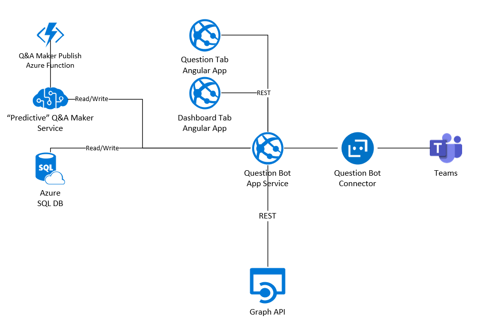

# Solution Overview

The QBot solution has the following main components:
* **Bot Registration**: The Azure Bot surfaced in a Teams channel
* **QBot API App Service**: Provides REST APIs to support QBot functionality
* **Dashboard Tab**: Angular 6 App surfaced as a tab in the QBot personal chat
* **Questions Tab**: Angular 6 App surfaced as a channels tab
* **SQL Database**: Stores QBot questions, user and course configuration
* **QnA Maker**: Drives 

There are also the various Azure App Registrations that are used to authenticate and authorise the various components. Full details can be found in the [deployment guide](deployment-guide.md)

## Bot Registration
A Microsoft Bot Channels Registration. The messaging endpoint will be set to the **QBot API App Service** and must enable connection to a Microsoft Teams channel.

## QBot API App Service
This is an .NET Web API hosted within an Azure App Service.
It handles the bot conversation and workflow logic using the Microsoft Bot Framework V3 SDK. In addition, it also provides API method calls to support management of QBot application used by the **Dashboard Tab** and **Question Tab** apps

The API uses Entity Framework 6 when connecting to the QBot SQL Database.
The API uses both v1.0 and beta versions of Graph API

## Question Tab
This is an Angular 6 application deployed to an Azure App Service. Within the QBot solution, it is hosted within a Microsoft Teams tab. It displays a summary of all  questions asked by users within the channel (both answered and unanswered).

## Dashboard Tab
This is an Angular 6 application deployed to an Azure App Service. Within the QBot solution, it is hosted within a Microsoft Teams static tab. It faciliates administrative functions used to manage the QBot solution within the team.

## QnA Maker Service
The QnA Maker knowledge base drives all answering and learning aspects of the QBot.

## SQL Server Database
Stores the list of users, roles, tutorial groups, user-tutorial mappings, assessments, questions, attachments and QR code references, and the configuration settings.

